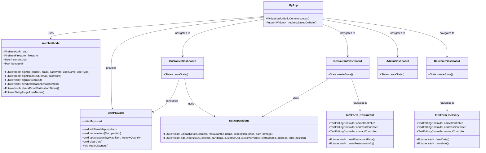
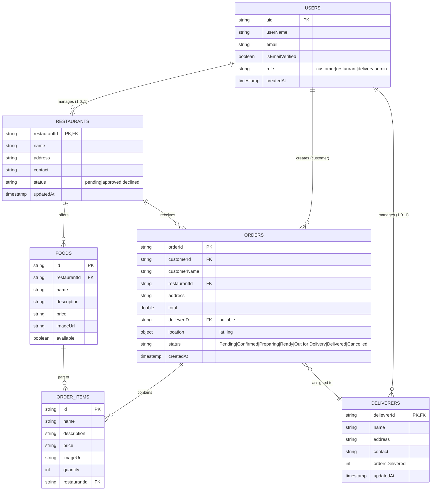
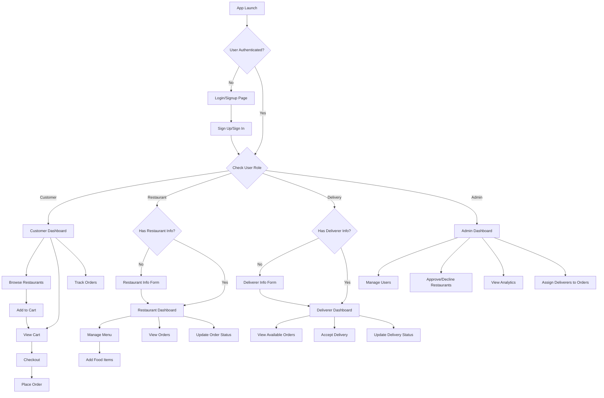

# Smart Food Delivery App - Class & ERD Diagrams

## Table of Contents
1. [System Overview](#system-overview)
2. [Class Diagram](#class-diagram)
3. [Entity-Relationship Diagram (ERD)](#entity-relationship-diagram-erd)
4. [Database Structure](#database-structure)
5. [User Flow Diagram](#user-flow-diagram)

---

## System Overview

The Smart Food Delivery App is a multi-role platform that connects:
- **Customers** - Browse restaurants, order food, track deliveries
- **Restaurants** - Manage menu items, process orders, update status
- **Delivery Drivers** - Accept delivery assignments, update delivery status
- **Admins** - Manage users, restaurants, monitor system analytics

---

## Class Diagram



---

## Entity-Relationship Diagram (ERD)



---

## Database Structure

### Firestore Collections

#### 1. **users** Collection
```json
{
  "uid": "string (PK)",
  "userName": "string",
  "email": "string",
  "isEmailVerified": "boolean",
  "role": "customer | restaurant | delivery | admin",
  "createdAt": "timestamp"
}
```

**Indexes:**
- Primary: `uid`
- Query: `role`, `email`

---

#### 2. **restaurants** Collection
```json
{
  "restaurantId": "string (PK, references users.uid)",
  "name": "string",
  "address": "string",
  "contact": "string",
  "status": "pending | approved | declined",
  "updatedAt": "timestamp"
}
```

**Indexes:**
- Primary: `restaurantId`
- Query: `status`

**Business Rules:**
- One-to-one relationship with users (where role = 'restaurant')
- Status is set to 'pending' upon creation
- Admins can approve/decline restaurant applications

---

#### 3. **delievrers** Collection
```json
{
  "delievrerId": "string (PK, references users.uid)",
  "name": "string",
  "address": "string",
  "contact": "string",
  "ordersDelivered": "number",
  "updatedAt": "timestamp"
}
```

**Indexes:**
- Primary: `delievrerId`
- Query: `ordersDelivered` (for ranking/stats)

**Business Rules:**
- One-to-one relationship with users (where role = 'delivery')
- `ordersDelivered` increments on successful delivery

---

#### 4. **foods** Collection
```json
{
  "id": "string (PK, auto-generated)",
  "restaurantId": "string (FK to restaurants)",
  "name": "string",
  "description": "string",
  "price": "string",
  "imageUrl": "string",
  "available": "boolean"
}
```

**Indexes:**
- Primary: `id`
- Foreign Key: `restaurantId`
- Query: `restaurantId`, `available`

**Business Rules:**
- Many-to-one relationship with restaurants
- Only available foods are shown to customers
- Restaurant owners can add/update/delete their food items

---

#### 5. **orders** Collection
```json
{
  "orderId": "string (PK, auto-generated)",
  "customerId": "string (FK to users)",
  "customerName": "string",
  "restaurantId": "string (FK to restaurants)",
  "items": [
    {
      "id": "string (FK to foods)",
      "name": "string",
      "description": "string",
      "price": "string",
      "imageUrl": "string",
      "quantity": "number",
      "restaurantId": "string"
    }
  ],
  "address": "string",
  "total": "number",
  "delieverID": "string | null (FK to delievrers)",
  "location": {
    "lat": "number",
    "lng": "number"
  },
  "status": "string (Pending|Confirmed|Preparing|Ready|Out for Delivery|Delivered|Cancelled)",
  "createdAt": "timestamp"
}
```

**Indexes:**
- Primary: `orderId`
- Foreign Keys: `customerId`, `restaurantId`, `delieverID`
- Query: `status`, `customerId`, `restaurantId`, `delieverID`, `createdAt`

**Business Rules:**
- Customer creates order from cart items
- Restaurant receives and can update status
- Admin can assign delivery driver
- Delivery driver can update delivery status
- Order lifecycle: Pending → Confirmed → Preparing → Ready → Out for Delivery → Delivered

---

## User Flow Diagram



---

## Key Features by Role

### 🛒 **Customer**
- Browse restaurants and food items
- Add items to cart with quantity management
- Place orders with delivery address
- Track order status in real-time
- View order history

### 🍽️ **Restaurant**
- Register and submit business details for approval
- Add/update/delete food items with images
- View incoming orders
- Update order status (Confirmed, Preparing, Ready)
- View order statistics

### 🚗 **Delivery Driver**
- Register and submit profile details
- View assigned delivery orders
- Access customer location information
- Update delivery status
- Track delivery performance metrics

### 👨‍💼 **Admin**
- Approve/decline restaurant applications
- Manage all users (view, delete)
- Assign delivery drivers to orders
- View system analytics (orders per day, pie charts)
- Monitor system health and statistics

---

## Technical Stack

- **Frontend:** Flutter (Dart)
- **Backend/Database:** Firebase (Firestore, Authentication)
- **State Management:** Provider
- **Image Storage:** Cloudinary
- **Location Services:** Geolocator package

---

## Security & Business Rules

1. **Authentication:**
   - Firebase Authentication for user management
   - Role-based access control (RBAC)
   - Email verification support

2. **Data Validation:**
   - Form validation for all user inputs
   - Restaurant approval workflow
   - Order status validation

3. **Data Integrity:**
   - Foreign key relationships maintained through references
   - Cascading updates for related documents
   - Transaction support for critical operations (order placement)

4. **Privacy:**
   - Customer location data only shared with assigned delivery driver
   - Admin has oversight but respects user privacy
   - Secure password storage via Firebase Auth

---

*Last Updated: 2025-11-26*
