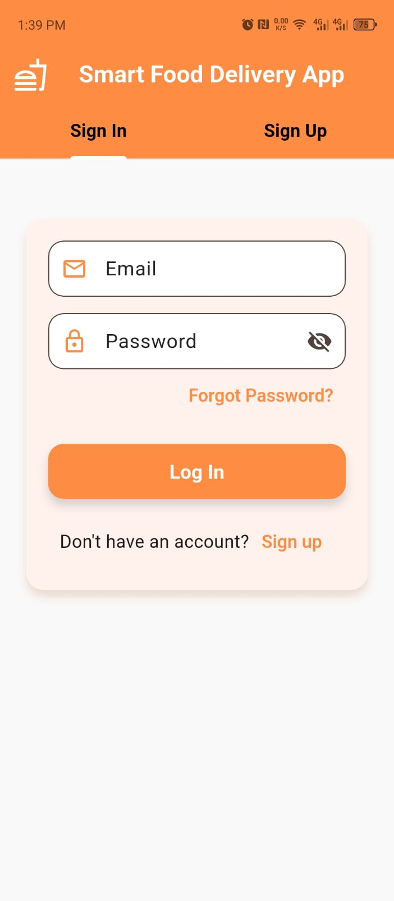
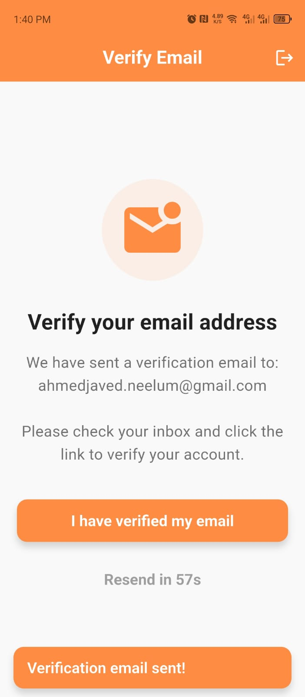
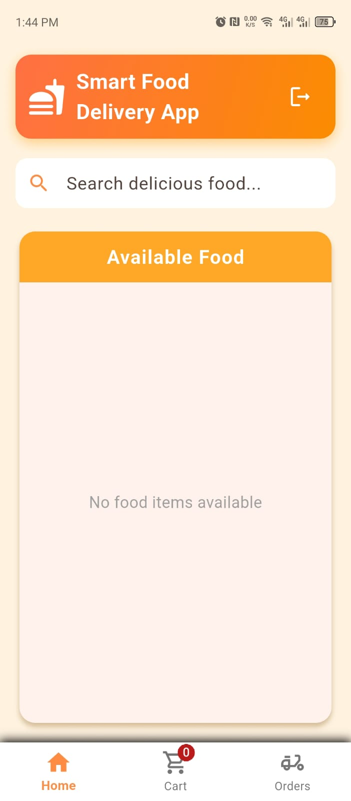
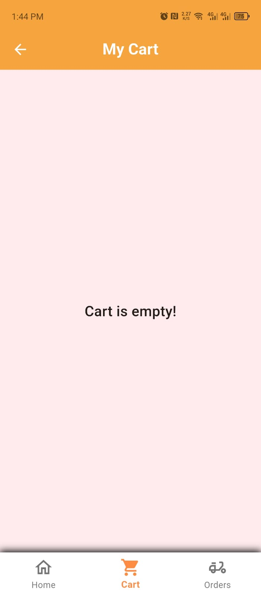
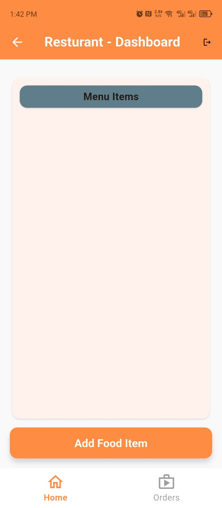
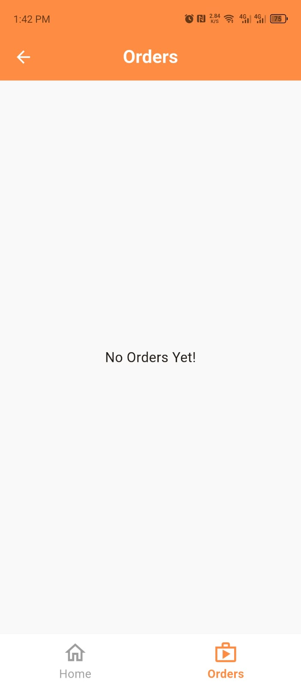
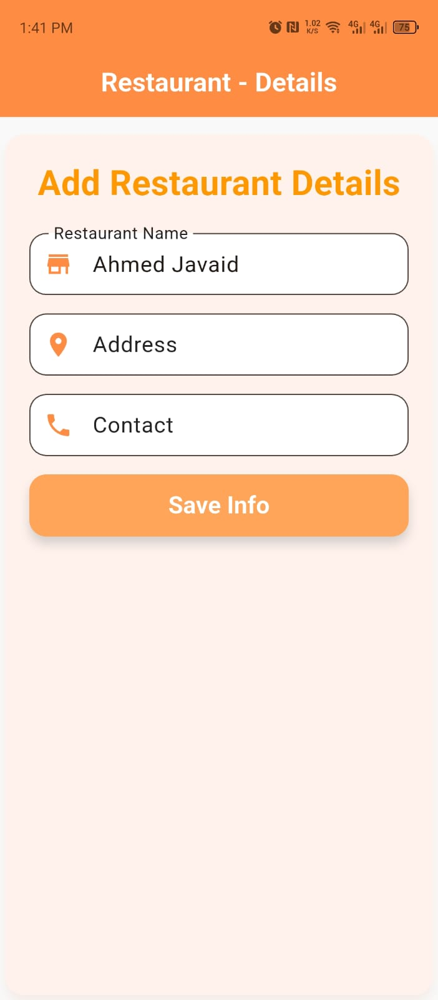
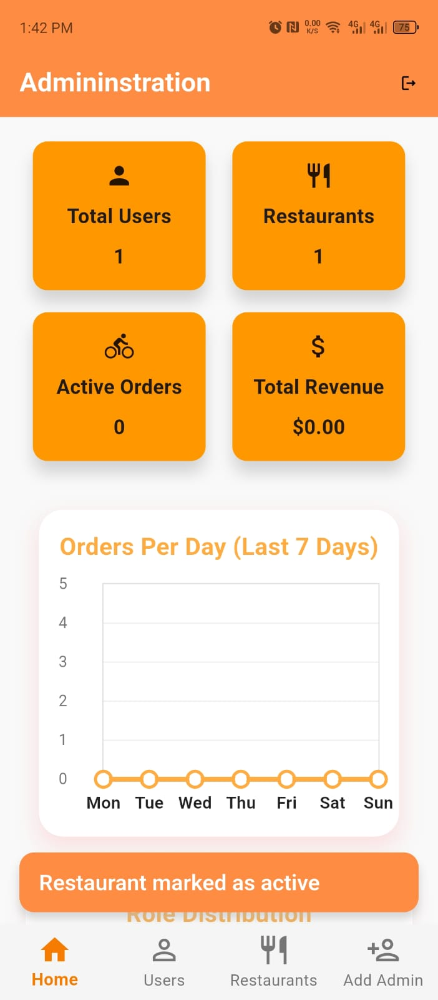
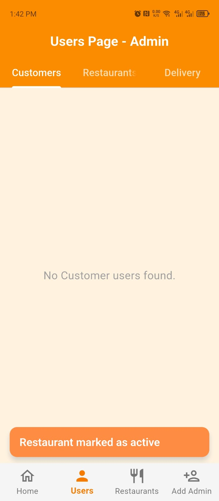
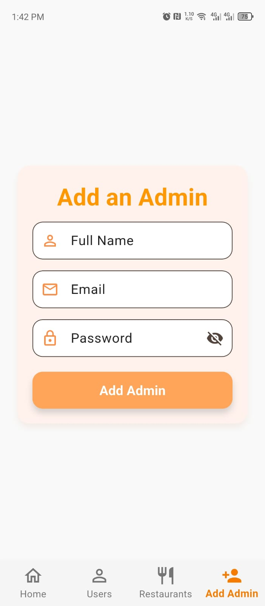

# 🍔 Smart Food Delivery App (SFDA)

<div align="center">


**A comprehensive, multi-role food delivery platform built with Flutter & Firebase**

[Features](#-features) • [Installation](#-installation) • [Screenshots](#-screenshots) • [Tech Stack](#-tech-stack) • [Contributing](#-contributing)

</div>

---

## 📖 About

**Smart Food Delivery App (SFDA)** is a complete food delivery ecosystem that connects **Customers**, **Restaurants**, **Delivery Personnel**, and **Administrators** in one unified platform. This is my **first Flutter project**, combining modern mobile development practices with real-world functionality.

> **Note**: While I utilized ChatGPT for guidance and learning, significant portions of this application were developed independently, implementing custom logic, UI/UX designs, and Firebase integrations.\
> **Note**: As a beginner there maybe alot faults in the project butt I have done my best for creating this app.

---

## ✨ Features

### 👤 For Customers
- ✅ **Secure Authentication** with email verification
- 🍽️ **Browse Restaurants** with real-time menu updates
- 🛒 **Shopping Cart** management
- 📍 **Real-time Order Tracking** with Google Maps integration
- 💳 **Order History** and profile management

### 🏪 For Restaurants
- 📋 **Menu Management** (Add, Edit, Delete items)
- 📦 **Order Management** (Accept/Reject orders)
- 📊 **Dashboard** with earnings analytics
- 🖼️ **Image Upload** for food items via Firebase Storage
- ⏰ **Real-time Order Notifications**

### 🚚 For Delivery Personnel
- 📍 **Live Delivery Requests**
- 🗺️ **Google Maps Navigation** to customer locations
- 🔄 **Order Status Updates** (Picked Up, Delivered)
- 📊 **Delivery History**

### 👨‍💼 For Administrators
- 📊 **Analytics Dashboard** with charts and graphs
- 👥 **User Management** (View all users by role)
- 🏪 **Restaurant Approval** system
- 📈 **Platform Statistics** (Orders, Revenue, etc.)

---

## 🖼️ Screenshots

### Authentication Flow
| Login/Signup | Email Verification | Forgot Password |
|:------------:|:------------------:|:---------------:|
|  |  |  |

### Customer Dashboard
| Home | Cart | Order Tracking |
|:----:|:----:|:--------------:|
|  |   |  |

### Restaurant Dashboard
| Dashboard |  Orders | Adding Restaurant Detail |
|:---------:|:------:|:---------:|
|  |  |  |

### Delivery Personnel Dashboard
| Active Deliveries | Navigation | Delivery History |
|:-----------------:|:----------:|:----------------:|
|  |  |  |

### Admin Dashboard
| Overview | User Management | Adding Another Admin |
|:--------:|:---------------:|:------------------:|
|  |  |  |

---

## 🚀 Installation

### Prerequisites
- **Flutter SDK** (v3.9.2 or higher) - [Install Flutter](https://flutter.dev/docs/get-started/install)
- **Android Studio** or **VS Code** with Flutter extensions
- **Firebase Project** - [Create Firebase Project](https://console.firebase.google.com/)
- **Google Maps API Key** (for location features)

### Step 1: Clone the Repository
```bash
git clone https://github.com/jawadahmedkhawaja/Smart-Food-Delivery-App.git
cd Smart-Food-Delivery-App
```

### Step 2: Install Dependencies
```bash
flutter pub get
```

### Step 3: Firebase Setup

1. **Create a Firebase Project** at [Firebase Console](https://console.firebase.google.com/)

2. **Enable Authentication**:
   - Go to **Authentication** → **Sign-in method**
   - Enable **Email/Password** provider

3. **Create Firestore Database**:
   - Go to **Firestore Database** → **Create Database**
   - Start in **production mode** or **test mode**

4. **Enable Firebase Storage**:
   - Go to **Storage** → **Get Started**

5. **Add Android App**:
   - Download `google-services.json`
   - Place it in `android/app/`

6. **Configure Email Templates** (Optional):
   - Go to **Authentication** → **Templates**
   - Customize **Email Verification** and **Password Reset** templates

### Step 4: Google Maps Setup

1. Get an API key from [Google Cloud Console](https://console.cloud.google.com/)
2. Enable **Maps SDK for Android**
3. Add the API key to `android/app/src/main/AndroidManifest.xml`:

```xml
<meta-data
    android:name="com.google.android.geo.API_KEY"
    android:value="YOUR_API_KEY_HERE"/>
```

### Step 5: Run the App
```bash
flutter run
```

### Step 6: Build Release APK
```bash
flutter build apk --release
```

The APK will be available at `build/app/outputs/flutter-apk/app-release.apk`

---

## 🛠️ Tech Stack

| Technology | Purpose |
|------------|---------|
| **Flutter** | Cross-platform UI framework |
| **Firebase Authentication** | User authentication & email verification |
| **Cloud Firestore** | Real-time NoSQL database |
| **Firebase Storage** | Image and file storage |
| **Google Maps Flutter** | Maps and location services |
| **Provider** | State management |
| **Geolocator** | Location tracking |
| **fl_chart** | Analytics charts and graphs |

---

## 📁 Project Structure

```
sfda_mark_1/
├── lib/
│   ├── main.dart                 # App entry point
│   ├── firebase_options.dart     # Firebase configuration
│   ├── pages/
│   │   ├── login_page.dart       # Authentication
│   │   ├── email_verification_page.dart
│   │   ├── forgot_password_page.dart
│   │   ├── admin/                # Admin dashboard pages
│   │   ├── customer/             # Customer pages
│   │   ├── restaurant/           # Restaurant pages
│   │   └── delievrer/            # Delivery personnel pages
│   ├── utils/
│   │   └── snack_bar.dart        # Utility functions
│   └── resources/                # Shared resources
├── assets/
│   └── images/                   # App images
├── android/                      # Android specific files
├── ios/                          # iOS specific files
└── pubspec.yaml                  # Dependencies
```

---

## 🗄️ Database Schema

### Collections

#### `users`
```json
{
  "uid": "string",
  "email": "string",
  "role": "customer | restaurant | delivery | admin",
  "emailVerified": "boolean",
  "createdAt": "timestamp"
}
```

#### `restaurants`
```json
{
  "uid": "string",
  "name": "string",
  "address": "string",
  "phone": "string",
  "imageUrl": "string"
}
```

#### `orders`
```json
{
  "orderId": "string",
  "customerId": "string",
  "restaurantId": "string",
  "deliveryId": "string",
  "status": "pending | accepted | preparing | out_for_delivery | delivered",
  "items": "array",
  "totalAmount": "number",
  "createdAt": "timestamp"
}
```

---

## 🔐 Security & Privacy

### Protected Files (Already in .gitignore)
- `android/key.properties` - Keystore credentials
- `android/app/google-services.json` - Firebase credentials
- `.env` files - Environment variables

### Google Maps API Key
⚠️ **Note**: The Google Maps API key in this repository will be **deleted after project submission**. If you clone this project, you must generate your own API key.

---

## 🤝 Contributing

This is an **open-source project** and contributions are welcome! Here's how you can help:

1. **Fork** the repository
2. **Create** a feature branch (`git checkout -b feature/AmazingFeature`)
3. **Commit** your changes (`git commit -m 'Add some AmazingFeature'`)
4. **Push** to the branch (`git push origin feature/AmazingFeature`)
5. **Open** a Pull Request

### Ideas for Contribution
- 🎨 UI/UX improvements
- 🐛 Bug fixes
- 📱 iOS platform support improvements
- 🔔 Push notification integration
- 💳 Payment gateway integration
- 🌐 Internationalization (i18n)

---

## 📝 License

This project is licensed under the **MIT License** - see the [LICENSE](LICENSE) file for details.

```
MIT License

Copyright (c) 2025 Jawad Ahmed

Permission is hereby granted, free of charge, to any person obtaining a copy
of this software and associated documentation files (the "Software"), to deal
in the Software without restriction...
```

---

## 🙏 Acknowledgments

- **ChatGPT** - For guidance and learning support
- **Flutter Team** - For the amazing framework
- **Firebase** - For the robust backend infrastructure
- **My University** - For the opportunity to build this project

---

## 📧 Contact

**Jawad Ahmed**
- GitHub: [@jawadahmedkh](https://github.com/jawadahmedkh)
- Email: jawadahmedkhawajaofficial@gmail.com

---

## 🎓 Project Details


- **Year**: 2025
- **University**: University of AJ&K **Neelum Campus**
- **Status**: Completed

---

<div align="center">

### ⭐ If you found this project helpful, please consider giving it a star!

Made with ❤️ by [Jawad Ahmed Khawaja](https://github.com/jawadahmedkh)

</div>
